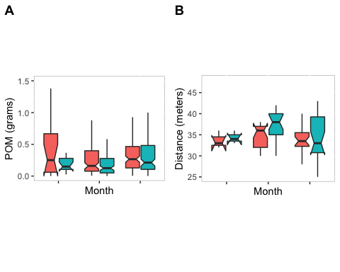

# Abstract

\newpage

# Introduction

The initial aim of the project was to determine the role kelp wrack plays in sandy beach ecology. This research would then provide the CoCT with direct evidence to support the practice of not removing kelp beach-cast from specific sections of beaches around the Cape Peninsula. However, due to limitations and the complex nature of the study sites the overall aim was adjusted. The focus of the current research was to determine the role kelp biomass plays in overall particulate organic matter (POM) content of beach soil, as this has been shown to be an important "bottom-up" diver of sandy beach ecological communities.  

## Background

Kelps dominate approximately 25% of global, shallow, rocky reef ecosystems and play a significant role in the functioning of these ecosystems. Kelps are 'ecosystem engineers' that provide a critical 3-dimensional habitat for fauna and various flora, and they are also highly productive organisms [@Dayton1985; @Steneck2002]. The high productivity of kelps allows important nutrients to be exported to adjacent and distant habitats as allochthonous production, and therefore their role in the food web is not limited to the shallow subtidal zone; instead they are the base for many connected coastal food webs [@Stuart1982; @Dayton1985; @Bustamante1995; @Duggins1997]. 

Sandy beach ecosystems have low amounts of productivity compared to other ecosystems such as rocky and estuarine mud-flats, with most of the productivity in sandy beach ecosystems represented by diatoms and bacteria [@Ince2007; @Koop1982; @Colombini2003]. Primary productivity of diatoms tends to be higher on beaches with fine sediment grain and low wave exposure, but never reach levels compared to other ecosystems [@Ince2007; @Dugan2011]. Macrofaunal communities on sandy beach ecosystems rely heavily  on organic inputs from the surf zone (diatoms and flagellates) or from the ocean (kelp-wrack, carrion, dissolved organics and particulates). These inputs are regulated by oceanographic processes such as upwelling, currents, waves and tidal action [@Ince2007; @Orr2005a]. Primary consumers in the form of suspension feeders and herbivores, consume phytoplankton, particulate organic matter, kelp and seagrasses which in turn become prey items for secondary consumers (invertebrates) [@Ince2007; @Krause-Jensen2016]. Predatory species (fish, lizards, shorebirds, baboons, etc.) prey upon both primary and secondary consumers as well as drift carrion [@Ince2007; @Dugan2011]. Therefore, allochthonous input plays an important role in maintaining sandy beach food webs from a bottom-up perspective. Kelps provide a significant amount to the overall allochthonous input in the form kelp-wrack found on sandy beaches in many coastal areas around the world [@Ince2007; @Krause-Jensen2016]. When kelp biomass accumulates on a beach is undergoes various biotic and abiotic processes. Examples of such processes are fragmentation, decomposition and remineralisation by bacteria, meiofauna and grazers [@Ince2007]. Once kelp biomass has been fragmented and/or remineralised, it can then be transported to the nearshore marine environment, or enter the atmosphere and be transported via wind to adjacent terrestrial ecosystems or stored _in situ_ within the beach sediment [@Ince2007; @Orr2005a; @Krause-Jensen2016]. There is also evidence that kelp derived organic matter provides an important energy subsidy into sub-marine canyons [@Harrold1998].

## Beach-cast in South Africa

Beach-cast kelp biomass around the Cape Peninsula is a consistent characteristic of beaches in the region. Kelps washed up on beaches originate from near or offshore kelp populations. During times of high wave energy or pulse disturbance events such as storms, kelps dislodge or stipes break which essentially kills the plant as it has no way of re-attaching itself. Kelp plants are deposited on beaches by coastal currents on almost a daily basis, and consist mainly of two species, e.g. _Ecklonia maxima_ and _Laminaria pallida_; they form what is known as beach-cast kelp or simply beach-cast Anderson2007b. Beach-cast is an important organic input into sandy beach ecosystems, and through wind, may be transported to adjacent and distant ecosystems [@Ince2007; @Koop1982]. In sandy beach ecosystems, kelp detritus is important in sustaining marine invertebrate communities, which in turn are important prey items for various bird species. A study by @Koop1982 investigated the biodegradation and carbon flow base in a sandy beach microcosm at Kommetjie beach in Cape Town, South Africa. The results showed that carbon flow via grazing invertebrates and through bacteria shows that 23-27% of the carbon in kelp is converted to bacterial carbon. Furthermore some species of nematodes are able to directly absorb kelp derived organic material [@Koop1982].  

Drift kelp that washes up on beaches around the Western Cape are managed by two agencies; the City of Cape Town (CoCT) and the Department of Agriculture, Forestry and Fisheries (DAFF) [@Yoshikawa2013]. These two agencies differ in their perspectives on managing _E. maxima_ beach cast. DAFF monitors the collection of beach cast kelp for the South African coastline by issuing permits that allow rights holders to collect kelp for commercial reasons within specific concession areas [@Yoshikawa2013]. The commercial demand for beach cast kelp is not consistent and therefore rights holders may only collect during times of high demand [@Yoshikawa2013]. Examples of commercial applications of beach cast kelp are alginate production, pharmaceuticals and abalone feed [@Yoshikawa2013]. 

Within the concession areas, there are regions designated as Marine Protected Areas by South African National Parks (SANParks), and no kelp is collected from these areas [@Yoshikawa2013]. This is due to the recognition of the ecological significance of beach cast kelp in coastal ecosystems. Kelp that is washed ashore is an important source of nutrients for invertebrate communities and provides an important bottom-up control mechanism for beach ecosystems [@Dugan2011]. Furthermore, research elsewhere in the world has shown that beach cast kelp is important in the formation and stabilisation of dunes [@Ince2007]. Although it has a significant role to play in beach systems, the decomposition process of kelp releases a foul odour in the form of hydrogen sulphide [@Dugan2011]. This is a point of concern for ratepayers who complain that the kelp needs to be removed for aesthetic reasons. The CoCT recognises both the ecological significance of beach cast kelp and is cognizant of the concern of ratepayers and the possible negative consequences on tourism at specific beaches (e.g. Clifton beach and Camps Bay) due to the smell and other unsatisfactory conditions caused by decomposing kelp. The CoCT, therefore, collects beach cast kelp from predetermined beaches and disposes the kelp in landfills as there is currently no procedures in place to process and dispose of kelp in a sustainable manner [@Yoshikawa2013].

[I'll insert here a bit about the initial aim, and then talk quickly about why this was changed. I have added this to the introduction]

Since kelp biomass has been shown to be an important detrital input in sandy beach ecosystems, the removal of beach-cast may therefore affect the overall particular organic matter (POM) content available within the sediment of sandy beaches, which could possibly lead to a bottom-up affect on food webs.

## Aims and Objectives

The aim of this study was to determine if clearing of kelp from beaches affects POM content of beach sediment This aim will be met through the following objectives:
1) Sample sediment from beaches designated as "cleared"" and "non-cleared" of kelp.
2) Determine if there are any differences in POM content of cleared and non-cleared areas of selected beaches.
3) Determine if differences in POM content are driven by other factors such as kelp biomass and transect length.
4) Make recommendations regarding the importance of kelps for the ecological functioning of sandy beach ecosystems in the CoCT region.

# Study sites

Various beaches around Cape Town are divided up into 'cleared' and 'non-cleared' areas by the City of Cape Town. This study focuses on a subset of these beaches (Figure 1), selected to cover a range of wave dynamics as determined by Dr. Christo Rautenbach, Chief Marine Scientist, South African Weather Service.

## Hout Bay east and west

Hout Bay beach is essentially one beach divided by the mouth of the Disa River. The Disa River is highly polluted, with a clear warning sign in view for beach-goers. Due to residential development adjacent to the estuary, the mouth of the river closes more frequently causing a build-up of polluted water. 

On the east side, the cleared area of the beach is characterised by a large parking lot, residential and commercial structures, and forms the "no dogs allowed" of Hout Bay beach. Activity on the beach tends to be high in the morning and slows down in the afternoon. Small dunes with low vegetation cover are located behind the non-cleared area. Shell debris is common in the non-cleared area.

On the west side, the cleared area comprises a small parking lot and wharf which forms one end of the Hout Bay harbour, as well as a storm water pipe mouth in the parking area leading onto the beach. This is the "dog-walking" section of beach, which continues until the Disa River mouth. Activity is high in the morning and weekends, and attract beach-goers due to the wharf and harbour.The non-cleared area is characterised by dunes and little vegetation cover. During the course of this study, the non-cleared area was undergoing stabilisation/rehabilitation construction. The dunes were first graded and then fencing was placed, which covered the entire dune system. 

## Muizenberg

Muizenburg was the largest beach in this study compared to other beaches sampled. The cleared area comprises of a parking lot with commercial structures such as restaurants and various shops, which attracts beach-goers to the area. The non-cleared section has a slightly lower activity and consists of a mixture of structures (beach huts, bridge), and dune system with established vegetation. Shell debris is common closer to the surf zone and litter is common throughout.

## Fishoek

Fishoek was the smallest beach in the study. The cleared area comprises of a large parking lot and small commercial and public structures (restaurant, playground, police services etc.) and two storm water pipes on either end of the area. The non-cleared area of beach comprises a dune system with established vegetation.  

On both areas dog-walking is allowed and activity tends to be lower compared to other beaches in the study. Both areas were also well maintained with no litter found during the course of sampling.

## Strandfontein

The cleared area is characterised by a large parking lot, beach pavilion and tidal pool. There is also construction activities between the tidal pool wall and beach. Activity was high on the day of sampling relative to the other beaches in the study. The non-cleared area has low activity and characterised by and extensive dune system and established vegetation. The beach is fairly well maintained and very low amount of litter was noted. Shell debris was common in surf zone in both cleared and non-cleared areas.  
RESEARCH APPROACH AND METHODS

# Research approach and methods
## Data collection

The aforementioned beaches were sampled for POM content in the sediment by sampling between the low-tide and high-tide line, or as far as possible if any structures were in the way. Each transect was divided into five sections according to the length of the transect on that particular sampling occasion. Sediment samples, 20cm deep, were taken each time and placed in a small ziplock bag and labelled. Each sample was weighed, dried, re-weighed, placed in a muffle furnace at 400 °C and finally re-weighed. The difference between in grams between the start and end weight (prior to and after placed into the muffle furnace) was used as an estimate as particulate organic matter (POM) content. This method is know as "loss on ignition" [@Santisteban2004; @Byers1978].

## Data analysis

All data analyses were done using the R Software for Statistical Computation and Graphics [@Rmanual], the vegan [@veganmanual] package, and ggplot2 [@ggplot2book]. Summary statistics were calculated and the Shapiro-Wilk normality test was run before any analyses to investigate the distribution of the data. Non-parametric visual comparisons in the form of boxplots and Kruskal-Wallis Rank Sum Test was used to test for any significant differences in POM. Boxplots were also used in each instance to investigate any significant differences in transect length. 

## Cleared and non-cleared areas

The POM data for entire study was pooled into cleared and non-cleared categories. These data included all sampling days of the study. A Kruskal-Wallis Rank Sum Test was used to test for differences in POM between cleared and non-cleared areas. A boxplot was used to visualise any differences in POM between cleared and non-cleared areas.

## Cleared and non-cleared areas in each month

The data for each sampling date were pooled into months during which the study took place (February, March, April) as well as cleared and non-cleared areas. A combination of scatter plot and boxplot was used to investigate any differences in POM visually and a Kruskal-Wallis Rank Sum Test was used to test any differences statistically.  

## Cleared and non-cleared areas between sites

Data were grouped according to site and area. This allowed investigation into any possible differences in POM between sites. A boxplot was used to allow visual comparison of POM between sites and areas, and a Kruskal-Wallis Rank Sum Test was used to verify findings. 

## Correlations

To investigate if transect length and kelp estimates may be affecting POM content sampled, correlation between paired samples was performed. To investigate whether transect length is correlated to POM, the mean transect length and POM was calculated for cleared and non-cleared areas on a given sampling day. To investigate whether beach-cast kelp influenced POM, the mean POM and transect length was calculated by day, site and area. This approach for the beach-cast kelp estimates and POM correlations was chosen as kelp estimates were performed separately for both cleared and non-cleared areas. 

# Results

## Cleared and Non-cleared areas

Shapiro-Wilk's normality test showed that POM data was not normally
distributed across samples (_w_ = 0.971, _p_ < 0.05). Visual comparison and a Kruskal-Wallis test showed no significant difference in total POM (_p_ < 0.05, Figure 1) between cleared and non-cleared areas.

## Cleared and non-cleared areas in each month

No significant differences between cleared and non-cleared areas were found over the course of the study, and only a significant difference in transect length was found for March (see Figure 2). The POM findings findings were verified by a Kruskal-Wallis test which showed no significant differences (_p_ < 0.05, Figure 2) in POM between cleared and non-cleared areas over the three months sampling took place. 

## Cleared and non-cleared areas between sites

A visual comparison showed a significant difference in POM content between cleared and non-cleared areas for Hout Bay West only. This was verified by a Kruskal-Wallis test which showed significant differences in POM (_p_ < 0.05, Figure 3). Visual comparison showed significantly higher transect lengths for non-cleared areas than cleared areas at Fishoek, Hout Bay East and Muizenberg.

## Correlations

No significant correlation was found between transect length and POM (_z_ = -1.072, _p_ > 0.05) or kelp estimates in cleared (_z_ = -1.040, _p_ > 0.05) and non-cleared (_z_ = -0.491, _p_ > 0.05) areas.

# Conclusion and recommendations for follow-up action

Kelp wrack on beaches provides an important energy subsidy into sandy beach ecosystems, and it which drives "bottom-up" control of invertebrates, in turn affecting other organisms such as bird species. POM is a breakdown product of kelp decomposition, and gets produced by combined physical (abrasion and other forms of mechanical action) and biological decomposition processes. In the absence of _in situ_ autochthonous primary production, wrack-derived POM forms the sole source of nourishment for sustaining most species of sandy beach macrofauna and meiofauna [@cisneros2011; @ortega2017]. The results from this study were surprising as POM content in cleared areas tended to not be different in its POM content compared to that taken from non-cleared areas. 

There was also no significant difference in POM content between sites, with Hout Bay West as the exception. The significanly higher POM content at Hout Bay West may be due to beach activities and point sources of pollution. For instance, the cleared section of Hout Bay West is a popular area for dog walking and a drain pipe leading onto the beach from the parking lot is also present, which may be adding to POM content in this area.

The built up areas, wind and lack of adjacent sand dunes may be contributing to the slightly higher POM content in cleared areas. Once kelp has been washed onto beaches it begins to degrade through various abiotic and biotic processes. The organic material may also enter the atmosphere through wind action, which transports the organic matter to distant and adjacent marine and terrestrial ecosystems [@Ince2007]. However the human structures in and around the beaches (walls, parking lots, buildings, etc.) may be preventing the transport of POM by wind. In other words, unlike pristine sandy beaches where wind would transport some of the POM to nearby ecosystems, the sandy beach ecosystems in this study were characterised by limited dune systems and human structures. Instead, POM content builds up over time and may also be compounded by point and non-point sources of pollution such as drain pipes and runoff.

Therefore, the beach-cleaning activities by the CoCT may be necessary in order to prevent the build up of POM in beach soils, as this may become toxic in high concentrations. 

The lack of data and communication from the City of Cape Town was a significant barrier that could not be overcome. The data-set promised by the City was not sent to us, despite various requests and meetings, and therefore the aim of the study could not be met entirely. Security issues at Strandfontein Beach and Strandfontein resort meant that sampling only occurred once at these sites. Also, the beaches sampled in this study may be significantly influenced by other factors such as land-use change, runoff, pollution, wave exposure and wind. Therefore, due to the complexity of study sites it was difficult to determine if beach cleaning activities are driving POM content in beach sediment around the Cape Peninsula. 

* No suitable environments are available to study the affects of kelp deposition on beach stability. The initial intent was to to test the hypothesis that primary sand dune are stablished by the presence of kelp wrack, which facilitates the establishment of pioneer dune species, and this ultimately resulting in a well-vegetated dune system. However, upon receiving the initial data from the city regarding which areas are designated cleared vs. non-cleared, 

It is recommended that in future better communication between researchers and CoCT staff is established, and that requested data is shared in a timely manner. Furthermore, future studies should include beaches where other anthropogenic sources of influence are limited and should include as many beaches along the coastline as possible. 

# Budget

## References

